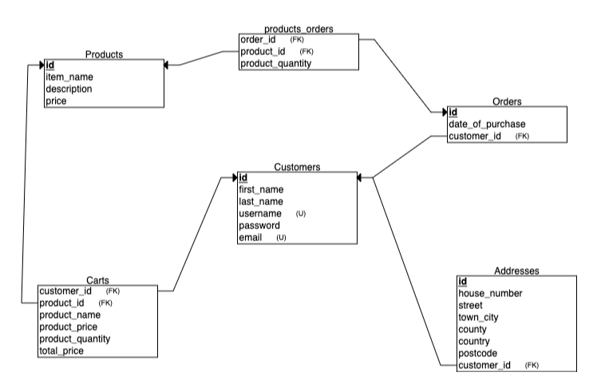

# e-Ecommerce API (WIP)

An e-commerce RESTful API built using Express, Postgres and Node.  

To run this locally, fork the project or download locally and run the server with ```npm start``` or with nodemon ```nodemon server.js```.

## Entity Relationship Diagram:



## Notes/TODO:

Still WIP as a couple of routes need fixing and the Passport LocalStrategy authentication needs some work. 

If I were to do this again I would emphasise the importance of a solid database design as I realised only too late that a couple of routes required some better planning on the database side. I would update the project with 'real' data (or at least fake data that more accurately corresponds across the tables) as well as modularise some of the functions (to do).

I would also refactor the code to utilise promises for improved error handling and up to date syntax. 